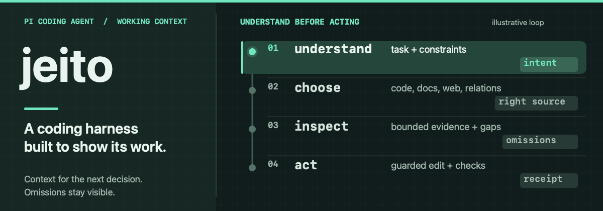

# jeito

jeito is the [Pi coding agent](https://pi.dev/) harness I built for work where the agent needs to explain why a change is justified. A search result can identify a promising file while the file itself has already changed. That result is a lead; it does not grant permission to edit. I wanted the distinction to hold across the instructions the agent receives, the tools it can call and the evidence it returns. I use jeito in my own setup; this public branch is a source presentation, not a supported release.

The animation illustrates the intended path, not a captured run. In an unfamiliar repository, `explore` and `docs_search` help locate the owner. `read` supplies exact current lines under a file hash. `edit` accepts only source the agent has seen and checks that authority again before changing bytes. A stale target is refused or returned with current source for recovery. Diagnostics and focused tests then answer different questions about the result. This is why a green test alone cannot stand in for an inspected change.

## Keep tools and evidence under control

The edit boundary is only useful if the agent can keep working without flooding its context or losing its evidence. [shell](extensions/shell/README.md) lets a slow command continue after the wait ends and keeps its captured output available for a later, narrower read. Exact-output runs can bypass compression. [websift](extensions/websift/README.md) retains extracted pages so a short excerpt can be checked against the source later; a search hit or generated answer remains a lead until inspected.

Tools have their own context cost. [tooltap](extensions/tooltap/README.md) starts with a small active set and delivers an optional tool's contract when it becomes relevant, without rewriting earlier instructions merely to activate it. That preserves the *possibility* of provider cache reuse, not a guaranteed hit. [guidepin](extensions/guidepin/README.md) follows the same concern from another angle: it appends working reminders instead of changing earlier messages, at the cost of accumulating text as a session grows. The versioned [working instructions](config/APPEND_SYSTEM.md) put these choices into the agent's ordinary decision process.

## What is in the suite

| Extension | Why it is here |
|---|---|
| [codeweave-pi](extensions/codeweave-pi/README.md) | Connects project navigation and documentation to exact, hash-authorized source edits. Search and current-file authority remain separate. |
| [shell](extensions/shell/README.md) | Keeps long-running work alive and its captured output recoverable without pasting the whole log into the conversation. |
| [tooltap](extensions/tooltap/README.md) | Lets the agent discover and enable selected tools later while keeping earlier input stable within a model epoch. |
| [websift](extensions/websift/README.md) | Changes search method when the evidence calls for it and keeps retrieved material available for checking. |
| [draft-lift](extensions/draft-lift/README.md) | Revises an unsent request in a separate exchange; the person compares it before assigning the task. |
| [guidepin](extensions/guidepin/README.md) | Keeps working guidance visible through append-only reminders and supplies the suite's goal-management skill. |
| [fff search](extensions/fff-search/README.md) | Adds indexed `@file` completion in the editor without adding a model-facing search tool. |
| [stall-guard](extensions/stall-guard/README.md) | Resumes a watchdog-tagged stalled turn only after Pi settles and the tagged failure is still newest. The watchdog is separate. |

[context diagnostics](extensions/context-diagnostics/README.md) is a standalone development package. It captures Pi-assembled prompt and tool state for debugging, which can contain sensitive material; it is not loaded with the suite.

## Inspect the decisions

The source is the useful companion to this overview. [codeweave-pi's edit engine](extensions/codeweave-pi/src/tools/edit.ts) and [source-authority layer](extensions/codeweave-pi/src/core/source-authority.ts) show how an inspected line becomes an editable one. The [hashline tests](extensions/codeweave-pi/tests/v3-hashline-read-edit.test.mjs) exercise that boundary. The [tooltap contract](extensions/tooltap/docs/contract.md) describes late activation and its fail-closed execution rules; the [websift design](extensions/websift/docs/DESIGN.md) separates provider results from retained source. These are implementation and focused-test evidence, not measurements of better agent outcomes.

The public GitHub branch omits prebuilt pi-nav executables and native modules, the locally adapted vendor tree, and local working records. The production codeweave-pi Core payload is also absent. There is no supported installation or platform guarantee yet. The [installation guide](docs/getting-started.md) describes checkout experiments and their prerequisites; [source and distribution gaps](docs/publication-readiness.md) record what a supported release would still need. [Documentation routes](docs/README.md), [contributor guidance](CONTRIBUTING.md), [licenses and attribution](THIRD_PARTY_NOTICES.md), and the [security policy](SECURITY.md) remain available without presenting this snapshot as a finished product.
