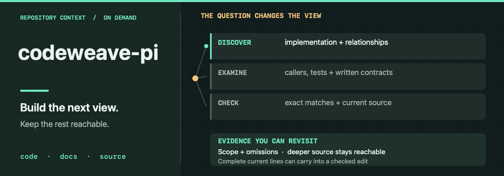

# codeweave-pi

codeweave-pi is jeito's codebase-understanding layer. Its claim: what an agent can safely conclude about a codebase is bounded by the authority of its evidence, not by the volume it reads. One retrieval ranking cannot carry a decision that may rest on a single overlooked caller or on a written contract that has drifted from its code. codeweave-pi keeps three kinds of evidence apart and lets each keep its authority: relationships and document sections that suggest where to look, exhaustive audits that account for every eligible occurrence, and current source that settles what is true now.

That separation is what makes compact evidence safe. Every result states its scope and omissions and leaves deeper source reachable, so the next question can be chosen from what is actually known. An exhaustive audit that cannot fit its occurrences [fails closed instead of degrading into a ranked sample](tests/v3-grep-cap-fallback.test.mjs). An edit is authorized only by current source the agent has inspected. The intended payoff is fewer unsupported implementation decisions from less repeated reconstruction; agent time saved and patch quality are not measured.

## Why one ranking cannot serve all three claims

A relationship result connects symbols but can lag the tree and cannot establish runtime behavior. A project document states intent the implementation may have abandoned. Current source settles a file as it stands and cannot decide whether the change serves the user. Collapsing the three into one score blurs their limits exactly when the difference decides the next action. Prepared indexes report their project, generation and omissions instead of rebuilding silently inside a query. The [navigation doctrine](docs/harness-doctrine.md) records the reasoning; the [evidence map](docs/evidence.md) separates implemented capabilities from their proof limits.

Bounded answers keep their route back: pages and source references let the next inquiry go deeper or shallower when a lead changes the question. The extra turn has a cost. Omitted evidence that could redirect the implementation costs more.

## Why editing obeys the same boundary

An edit is where a wrong claim becomes a wrong change, so mutation is bounded by what the agent has actually inspected: complete, current source lines under the file's hash. Source the agent has not seen cannot be patched. If the file changes mid-task, parts whose targets still match can land while changed or ambiguous targets return for review; safe work stands and nothing unexamined is changed. The [source-authority decision](docs/decisions/proof-preserving-mutation.md) records why navigation and editing share one evidence boundary.

[Source-authority tests](tests/v3-live-source-authority.test.mjs) and [recovery tests](tests/v3-edit-recovery.test.mjs) exercise those boundaries and their refusal paths. They establish source-authority contracts only. Whether an agent chose the right owner, understood the request or produced a better patch is not measured, and a prepared graph, a written contract and current source can still disagree.

## Source and installation limits

This public tree omits prebuilt pi-nav executables and native modules, the locally adapted vendor tree, and the production Core payload with its pinned code model. **A bare clone cannot install the complete runtime.** A publisher-prepared checkout needs Pi, Node.js 22.19 or newer, npm, Git and matching assets; the Node floor alone does not prove native ABI compatibility. Installation verifies those assets, then provisions and exercises roughly 928 MiB of QMD models with first-install network and disk cost before registration. Startup does not compile or download them. Python 3.10–3.14 is needed only for optional Graphify; avoid registering this extension alongside another copy or the jeito aggregate.

[Setup](docs/setup.md) covers development and recovery; [current truth](docs/current-truth.md) separates source checks from loaded-runtime proof, and [third-party notices](THIRD_PARTY_NOTICES.md) cover bundled dependencies.