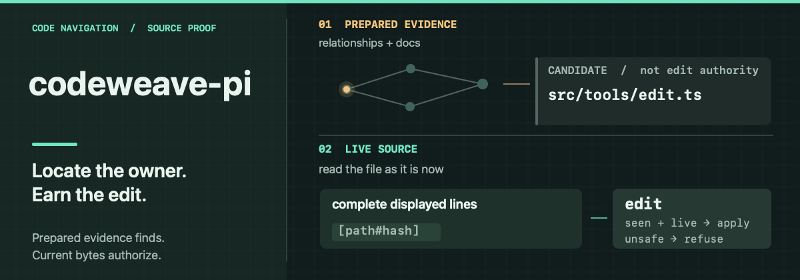

# codeweave-pi

codeweave-pi is designed to reduce the reconstruction involved in understanding and changing a codebase. It can bring implementation, relationships and project writing into the agent's view at different depths while leaving the underlying source and unanswered parts reachable. A ranked lead, an exhaustive occurrence audit and a current source read make different claims; their outputs retain those differences.

Editing also depends on what the agent has already seen. Complete source lines displayed during investigation can be reused after a current-file check, so an identical read is unnecessary. Changed observations are refused or recovered only when the observed target stayed the same. Focused tests exercise that connection between evidence and edit; they cannot establish whether agents choose better questions or deliver better code.

## Let the question determine the evidence

The [prepared code graph](native/analysis/README.md) supplies symbols and relationships; [document retrieval](docs/evidence.md) supplies sections of written project intent; exact search and source reads supply current bytes. These views answer different questions. A call relation, test or contract can change which part of the repository matters, and optional cross-domain maps connect code and writing when one view is insufficient. The agent can move among them as its understanding changes, without following a mandatory search-to-edit route.

Preparation runs outside the query. Results identify the selected project, generation and omissions; queries do not silently rebuild an index or install missing assets. The [navigation doctrine](docs/harness-doctrine.md) records the reasoning behind this choice. A prepared relationship can lag and cannot prove runtime behavior.

## Keep coverage visible in compact answers

A response budget forces choices about what the agent sees. Code and document results use bounded pages with a route back to the source and an indication when the answer is partial. Exhaustive queries keep their meaning: an oversized audit [fails rather than quietly becoming a ranked sample](tests/v3-grep-cap-fallback.test.mjs). On first exposure to a document, its authored title, description and references can appear without a long YAML header; [omitted references confer no authority](src/core/markdown-frontmatter.ts). The agent can inspect a wider or narrower slice without treating the first result as complete.

## Carry inspected source into an edit

A [source read](src/tools/read.ts) shows numbered current lines under a file hash. Complete verbatim lines already displayed by an eligible search or relationship result can be [checked against live source](src/core/source-authority.ts) and passed to the [edit engine](src/core/patch-apply.ts) without repeating the read. The hash and recorded lines limit the edit. If the file changes, unchanged observed targets can sometimes be recovered; changed or ambiguous ones are refused. An edit lands per file, so a failure in a later file does not undo an earlier change.

[Focused tests](tests/v3-live-source-authority.test.mjs) exercise the displayed-row handoff and refusal of unseen lines; [recovery tests](tests/v3-edit-recovery.test.mjs) cover ambiguous or changed targets. They establish source boundaries, not whether an agent chose the right owner or made a better change. Written intent can be stale, the graph can be incomplete and a file hash cannot settle what the user meant.

## Source and installation limits

This public tree omits prebuilt pi-nav executables and native modules, the locally adapted vendor tree, and the production Core payload with its pinned code model. **A bare clone cannot install the complete runtime.** A publisher-prepared checkout needs Pi, Node.js 22.19 or newer, npm, Git and matching assets; the Node floor alone does not prove native ABI compatibility. Installation verifies those assets, then provisions and exercises roughly 928 MiB of QMD models with first-install network and disk cost before registration. Startup does not compile or download them. Python 3.10–3.14 is needed only for optional Graphify; avoid registering this extension alongside another copy or the jeito aggregate.

[Setup](docs/setup.md) covers development and recovery; [current truth](docs/current-truth.md) separates source checks from loaded-runtime proof, and [third-party notices](THIRD_PARTY_NOTICES.md) cover bundled dependencies.
