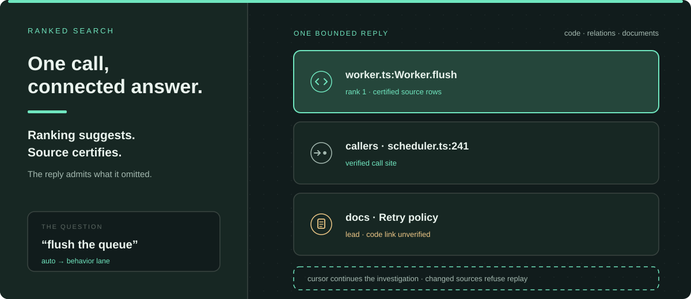
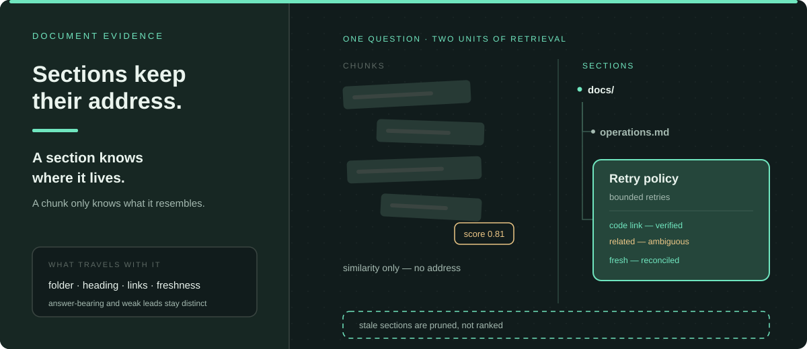

# codeweave-pi

**codeweave-pi is jeito's core: the evidence engine for changing codebases before they are fully understood.** The quality of a change cannot exceed the authority of its evidence. A relationship suggests an owner; current bytes settle a file; a written contract explains intent. Those claims stay apart — when they blur, a plausible patch becomes a wrong change.

Stock tooling optimizes for finding text — resemblance, occurrence, volume. codeweave-pi optimizes for settling questions: who owns this behavior, what the project promised, what still agrees, what can safely change. Context is spent only where it retires that uncertainty. The unit of progress is uncertainty retired.

Five prior arts ground the design: QMD's document retrieval, Tilth's native file tooling, Semble, code-review-graph's relationship-first graphs, and CodeGraph's maintained call graphs. Their lessons fuse under one authority model — sections beat chunks, live structure beats cached text, relationships beat proximity, a maintained graph beats a re-parsed guess.


## The trade-off behind each call

Eleven tools, one per evidence reality. Each settles one kind of question and claims no more than it can prove.

| Question that must settle | Capability | What the answer may claim |
| --- | --- | --- |
| Who owns or implements this behavior? | ranked `grep`, `explore` | ranked candidates with their supporting evidence |
| What connects to what? | `trace`, `explore` map | typed structural edges — never runtime flow |
| What did the project promise in writing? | `docs_search` | sections with hierarchy, relationships and freshness |
| What do the bytes say now? | `read`, `find`, `ls` | current rows, ranges and directory truth |
| What changed? | `diff` | current patch, with graph planning labeled apart |
| What may safely change? | `edit`, `write` | only inspected current rows, under a whole-file hash |
| Did the change break anything? | `lsp_validate` | scoped diagnostics, explicitly unconfirmed when unconfirmed |

**Discovery before containment.** A familiar name is not a boundary. Broad, ranked discovery earns the owner, the callers and the tests first — a precisely correct patch inside the wrong subsystem is the failure this rule refuses.

**Value before cost.** Two calls that retire the same uncertainty compare on cost; a call that retires more of it wins. Speed is a resource, not the objective.

**Pure queries.** A question never installs, indexes or repairs the project it studies. Preparation happens outside the turn, so read-only work stays read-only and evidence cannot be contaminated by the act of asking.

## Ranked grep: one call returns the connected answer



**Why it exists.** Ownership questions fan out — the declaration, its callers, the document that promises its behavior. Common tools answer one dimension per search and leave the reconstruction to the agent. One ranked call returns the connected answer.

**The trade-off.** Ranking commits to an opinion and shows the evidence that placed each candidate. The alternative — a flat occurrence list — hides its opinion and charges the reader with the judgment. When every occurrence matters, the exhaustive `matches` lane accounts for each one or [fails closed rather than degrade into a ranked sample](tests/v3-grep-cap-fallback.test.mjs).

**What it guarantees.** Every claim carries its verification state: a source-verified association leaves the prose uncertified, a source-verified lead leaves the code link uncertified. An executed zero is evidence — a literal pattern with regex-looking tokens earns one precise recovery invitation. Zero, partial and complete always read differently.

**Why bounded replies win.** An answer past its ceiling returns as a retained investigation: same question, focus, scope and source versions, continued by cursor. Conventional result caps drop evidence silently; this one admits what it omitted and refuses to replay against changed sources.

## Documents keep their place in the tree



**Why it exists.** A written contract has an address — a folder, a heading, neighbors that depend on it. Chunk retrieval discards the address and returns resemblance. Sections keep it, with their authored title and description and every `code:` and `related:` link validated as valid, invalid, ambiguous or unverified.

**The trade-off.** Section identity must be reconciled with the tree, maintenance kept outside the query. Trusting a cache is cheaper and lets a retired plan outrank current code. The price buys: stale sections are pruned rather than ranked, and current implementation outranks the plan that promised otherwise. A weak lead refines the next question instead of closing this one.

**The provider choice, stated once.** Local models (318 MiB embedding, 610 MiB reranker, 928 MiB measured in cache) are credential-free and private. Cloud modes send only section and query text, never a corpus. Lexical search needs no model at all.

**How it selects.** `auto` prefers an allowed configured cloud provider, then local inference. Hybrid readiness requires zero pending embeddings, and every degraded mode says so.

## Edits answer to inspected bytes

**Why it exists.** The common edit form asks for old lines to be re-quoted and replaced wholesale. It spends tokens re-typing provenance nobody verified, and one stale line discards the entire patch. Here an edit names its targets and replacement under a whole-file hash: provenance is checked, not retyped.

**The trade-off.** Authority is narrow on purpose. Only complete rows the agent inspected may change, and two identities — exact file bytes and the normalized edit snapshot — are kept and never averaged. The gain: a patch never covers unseen bytes. The cost: refusal when evidence is incomplete. A hash never authorizes what nobody read.

**Why salvage wins.** On a partial mismatch, the provably-safe parts land per file and the rest returns as exact residual work; a byte-identical target is a skip, not a failure. All-or-nothing edits discard verified progress; best-effort edits risk silent corruption. Salvage keeps both: nothing unexamined changes, nothing verified is thrown away.

**After the landing.** Syntax diagnostics and explicitly scoped LSP feedback follow every landing. The engine's closure benchmark is [recorded with its scope](docs/decisions/proof-preserving-mutation.md#code-and-verification).

## Reads that know where they are

**Why it exists.** Context is the budget, and a whole-file dump spends it on lines the decision does not need. A read is an address — ranges, symbols, sections, raw files — mixed up to eight chunks per call, each file header keeping its range.

**What it guarantees.** Outlines and metadata never count as source; only complete verbatim rows under the file hash can authorize anything. Rows an earlier result already displayed certify in place: same rows, same authority, no second copy in the conversation. Stock harnesses make the agent re-paste its proof; this one verifies what it already showed.

## Stays current without touching the query

**Why it exists.** Intelligence that silently decays is worse than none. Layered corpus policy decides what the graph may know; maintenance re-projects only what changed; every retained answer is invalidated the moment its sources drift.

**The trade-off.** Preparation costs work outside the turn — a census, a policy, incremental runs. In exchange, no query installs, builds or repairs, and none embeds repository nodes mid-question. A cached answer cannot outlive its evidence without saying so.

## Setup and configuration

Prerequisites: Pi 0.82.1+, Node.js 22.19+ (22.x or 24 — Node 23 lacks the built-in SQLite APIs), npm, Git, and a publisher-prepared package carrying the production Core payload and its pinned code model. First install needs network access.

```bash
cd /absolute/path/to/jeito
npm install --omit=dev --workspace @alehdezp/codeweave-pi --include-workspace-root=false
npm run install:codeweave-pi
```

Installation verifies the Core payload before registration. Document-index models are a separate, explicit step: `npm run qmd:model-provision -- --accept-model-terms` acquires the two pinned GGUF files (928 MiB measured) and nothing else. Queries never download.

`/navigation-setup` verifies the installed path read-only and never installs. The optional cross-domain graph lane (Graphify) needs Python 3.10–3.14, provisioned separately, stopped-Pi. Corpus scope lives in `~/.pi/agent/navigation-ignore` and `<project>/.pi/navigation/ignore`.

[Setup](docs/setup.md) owns the full path, repair tree and provider selection; [current truth](docs/current-truth.md) separates source checks from loaded-runtime proof.

## Boundaries

This public tree omits prebuilt pi-nav executables, native modules, the locally adapted vendor tree, and the production Core payload with its pinned code model. **A bare clone cannot install the complete runtime.** Prebuilt native targets are darwin-arm64 and linux-arm64; the Node floor alone does not prove native ABI compatibility.

Graph edges are leads, not runtime proof. Structured retrieval can be stale or partial, and says so. Focused tests establish source-authority, retrieval and edit contracts — improved agent outcomes, speed and patch quality are not measured claims.

## Provenance

The lineage stays visible: QMD's document retrieval, Tilth's native file tooling, Semble, code-review-graph's relationship-first graphs, and [CodeGraph](https://github.com/colbymchenry/codegraph)'s maintained call graph — the maintained analysis core is an owned derivation of it. The code encoder is upstream `minishlab/potion-code-16M-v2` (MIT).

The earlier code-review-graph runtime is retired; its relationship-first lessons remain in owned code. [Third-party notices](THIRD_PARTY_NOTICES.md) cover bundled dependencies, grammars and model terms; first-party code is [MIT licensed](LICENSE).