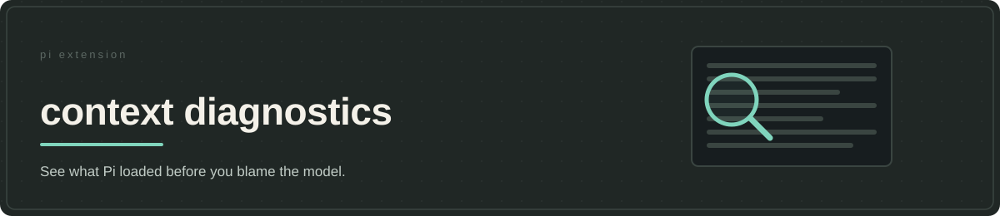

# context diagnostics



**Context Diagnostics shows the context the runtime actually assembled.** The settled debugging habit rewrites prompt files when an instruction seems ignored; the cheaper check is whether Pi assembled the instruction at all. A structured snapshot captures the system prompt, prompt options, registered tool descriptions and schemas, available messages, and model and context usage — enough to find a missing instruction or an unexpected tool definition before rewriting to solve the wrong problem.

This is **Pi-side state**, not a record of the final provider request. A registered tool might not be active or sent to the model; fields collected through optional APIs can be empty, and an absent field proves nothing about what the provider saw. The snapshot cannot explain a model's answer. Pi's own session export may already answer the question. Use this extension when you need structured files or captures at specific stages of a turn.

## Choose the observation point

`/dump-context` writes one file on request. If timing matters, start a debugging session with `PI_CONTEXT_DIAGNOSTICS_AUTO=1 pi`: the extension then captures before agent start, at the context hook and after the turn. Without that environment variable, those three hooks are not registered. Automatic captures are best effort and failures are swallowed so diagnosis cannot interrupt the work; an expected file may simply be missing. Restart without the flag for normal use.

Tooltap's `/stow-dump-context` answers a different question: what provider payload did *tooltap* observe on the last request, and which tools did it route? That dump still cannot rule out changes by later handlers. Context Diagnostics is useful earlier, while checking what Pi assembled and how that state changed between hook points. No shipped skill invokes `/dump-context`; install this package for a focused development investigation rather than loading it with the default suite.

## Handle the capture as private data

Files are written in `context-dumps/` beneath Pi's agent directory (`~/.pi/agent/` by default, or `PI_CODING_AGENT_DIR`). Labels are sanitized and truncated, with `manual` as fallback. New directories request mode `0700` and new files `0600`; existing permissions are not repaired, and captures with the same label in one second can overwrite each other.

A dump can contain private instructions, conversation, code and credentials. The extension neither redacts nor encrypts nor deletes it. Save only what you need, keep the result out of commits and issues, and delete it after the investigation. See the [security policy](../../SECURITY.md).

## Install for development

Context Diagnostics is not part of the jeito aggregate. It requires Node.js 22.19 or newer, npm and Pi (`@earendil-works/pi-coding-agent`) 0.82.1 or newer. Prepare the checkout first:

```bash
cd /absolute/path/to/jeito
npm install --omit=dev \
  --workspace @alehdezp/context-diagnostics \
  --include-workspace-root=false
```

Only if npm succeeds, register the prepared checkout:

```bash
pi install "$PWD/extensions/context-diagnostics"
```

Restart Pi after registration and keep the checkout at that path. It can run beside jeito because the aggregate does not register this command; do not load a second copy. Standalone installation does not apply the suite's host settings. See [installation and updates](../../docs/getting-started.md) or `/skill:jeito-setup` for guided setup and removal.

## Verification

```bash
npm test --workspace @alehdezp/context-diagnostics
```

The tests check manual saving, filename cleanup, new-file permissions and conditional hook registration. They do not exercise complete capture during a real Pi session. The package remains private to prevent accidental npm publication, but its first-party code is [MIT licensed](LICENSE); keep diagnostic output private.
