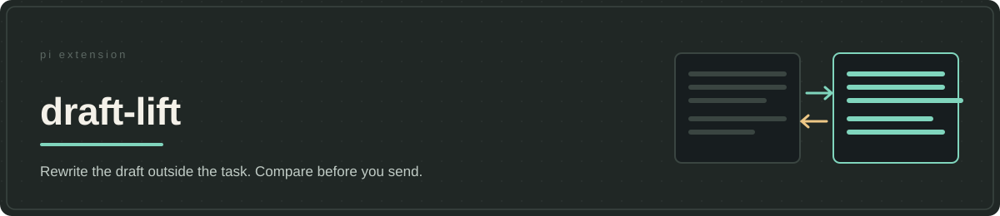

# draft-lift



**The request stays the person's.** draft-lift rewrites a draft in a separate exchange that can see the conversation, returns the candidate beside the original for review, and puts the chosen wording into the Pi editor unsent — only the person's submission assigns the work. Rejected versions stay out of the working conversation. The settled dilemma offered no good answer: phrasing the request inside the coding conversation litters the history the agent will work from, and phrasing it in a separate app loses the context the request depends on.

The rewrite instruction may only trace additions to the draft or accepted intent, replace what later corrections contradict, and leave uncertain requirements out; it asks for a focused question when one missing fact changes safe execution. No instruction proves the model understood the request: the side-by-side comparison is where changed meaning or an inflated assignment gets caught. A clear short request needs no extra model call.

## Review, replace and recover

`Ctrl+Shift+E` opens the comparison view. Feedback followed by `Enter` requests another version; an empty feedback field accepts a ready candidate, and `Esc` cancels when that field has focus. `/prompt-sidequest`, `Ctrl+Alt+E`, and `Ctrl+Shift+Q` instead rewrite the current draft directly into the editor; `/prompt-sidequest <draft>` uses explicit text. `Ctrl+Shift+Z` restores the saved original once, not an undo history.

Direct shortcuts and the bare command guard against replacing an editor that changed while the request ran: they leave it alone and copy the candidate to the clipboard instead. `/prompt-sidequest <draft>` and accepting from the comparison replace unconditionally, so review that boundary when editing concurrently. Repeating an identical draft within ten seconds is skipped.

Pi supplies the model, provider connection and prepared conversation. draft-lift adds the rewrite instruction and review interface. The request includes the main system prompt and active tool definitions but has no tool-execution loop; the rewriter cannot inspect files to settle facts outside the conversation. Its instruction forbids tool use. If a response is empty despite that instruction, the extension retries once without tool definitions and reports failure if the retry is also empty. Including the main prompt and tools is intended to leave room for prompt-cache reuse, **not evidence of an actual cache hit**. See [cache verification](docs/cache-parity.md).

## Privacy and limits

Diagnostics at `<PI_CODING_AGENT_DIR>/draft-lift/backlog.jsonl` record hashes, counts, usage and metadata rather than draft or conversation text. Session identifiers and paths still appear, and provider error messages can contain unredacted text. Keep the file private. `/prompt-sidequest log` reports its path; `cache-diag` makes a model request and can replace the editor contents.

The extension attempts to copy originals and some cancelled or unapplied rewrites to the clipboard with `pbcopy` on macOS, or `xclip`, `xsel`, then `wl-copy` elsewhere. Missing utilities fail silently, so clipboard recovery is not guaranteed. Each refinement costs a model call and review time. No test establishes faithful meaning, fewer downstream corrections or provider cache reuse.

## Install from a checkout

Requires Node.js 22.19.0 or newer, npm, and an interactive Pi session with a configured model/provider. The package declares Pi coding-agent, ai and tui 0.82.1 or newer; this is not a tested compatibility matrix.

From the repository checkout, prepare dependencies:

```bash
cd /absolute/path/to/jeito
npm install --omit=dev \
  --workspace @alehdezp/draft-lift \
  --include-workspace-root=false
```

Only after npm succeeds, register the prepared checkout:

```bash
pi install "$PWD/extensions/draft-lift"
```

Restart Pi. The jeito aggregate already includes draft-lift; do not register both copies. Standalone installation does not apply host-owned prompt or tool defaults. See [installation and updates](../../docs/getting-started.md#install-one-extension-from-a-checkout). No public standalone release is assumed.

## Verification and provenance

```bash
npm run check --workspace @alehdezp/draft-lift
npm run test --workspace @alehdezp/draft-lift
```

The focused tests check provider selection, command and shortcut registration, the rewrite instruction and feedback wording. They do not test the on-screen editor or whether a particular candidate preserves meaning. [`buildEnhancementInstruction` in `index.ts`](index.ts) defines the instruction; [architecture](docs/architecture.md), [decisions](docs/decisions.md) and [cache verification](docs/cache-parity.md) explain the boundaries. ADR-006 credits promptsmith's output-marker pattern. The [package manifest](package.json) declares MIT.
