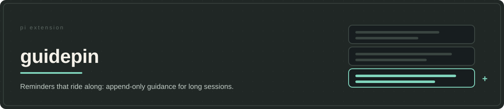

# guidepin



**guidepin keeps task guidance present in long sessions by appending reminders after the new request.** The system prompt recedes behind the current exchange as a session grows, and rewriting earlier input to resurface it would change bytes a provider might reuse. An appended reminder changes nothing before it.

This choice does not add memory. Pi already carries the instructions and conversation history. The reminder aims to make evidence, scope and current decisions prominent again without asking the person to repeat them. Whether that improves adherence has not been established, and recurring messages cost context. guidepin ships with jeito because its wording and cadence serve the [versioned system prompt](../../config/APPEND_SYSTEM.md); it is not a standalone Pi package.

## Keep a reminder where it was inserted

Refreshing guidance has a consequence beyond the new text. Replacing an earlier reminder or temporarily changing the system prompt changes input that the provider may have cached. A reminder intended to help the next action can invalidate reuse of a much larger part of the session.

guidepin appends each reminder as a persistent conversation message after the user's new request. Pi stores and serializes it normally. Later requests retain that same message in the same position; a future reminder adds another message instead of moving or replacing the old one.


The cost is cumulative: old reminders remain in context even if the provider reuses cached processing. A larger refresh can add up to 1,200 estimated tokens alongside the regular reminder; that estimate covers the refresh only. Persistent delivery preserves an opportunity for reuse, not a guaranteed hit or lower bill. The [delivery design](docs/pi-hooks-and-design.md) explains the alternatives and the prefix checks that distinguish this approach from a temporary prompt rewrite.

## Separate reminder delivery from maintaining the task

The package also supplies the [`goal-management` skill](skills/goal-management/SKILL.md). It helps the agent develop and test its interpretation of the intended outcome, including proactively reframing a mistaken understanding without silently expanding authority. Persistent work keeps the parent intent in `goal.md`, distinct unresolved outcomes or questions in `work.md`, and consequential choices with their reasons in `decisions.md`.

This record serves a different purpose from a transcript. It should let you or a later agent see which decisions still govern the work without reconstructing approval from everything discussed. Pi already supports ordinary notes; the skill provides [templates](skills/goal-management/templates/goal.md) and a convention focused on current intent, plus a Python [scaffolder](skills/goal-management/scripts/create_goal.py) that refuses to overwrite an existing goal. It is a use of [structured notes outside the conversation](https://www.anthropic.com/engineering/effective-context-engineering-for-ai-agents), not automatic memory synchronization.

Alignment is required, but file updates are conditional: preserve changed understanding when the existing account would materially misdirect continuation. A local correction or reminder does not itself require maintenance. A short task may need no goal folder. The hooks neither read nor write these records, and stale files never override current user instructions. The suite loads both the skill and reminder hook; the versioned system prompt owns the baseline intent contract.

## Delivery and visibility

With the suite active, the hook supplies a regular reminder on eligible agent runs and a larger refresh when due. The refresh draws from the appended system prompt (APPEND): the active one when available, or the host's APPEND file. Unavailable APPEND suppresses the refresh, not the regular reminder. Steering skips the regular reminder but can still receive a due refresh. Timing, branch tracking and compaction behavior are documented in the [delivery design](docs/pi-hooks-and-design.md); the repository's [versioned system prompt](../../config/APPEND_SYSTEM.md#1-frame-the-task-before-acting) owns the goal-maintenance contract.

Reminder text is sent to the model but hidden from ordinary conversation display. The visible `⟡ Partner lens` and `⟡ Partner refresh` labels mark insertion; they are not the reminder text. The shared goal reminder reinforces checking interpretations and proactively revising mistaken framing, not file maintenance. Each larger refresh also says it is not a new task or permission to reopen completed work. Delivery tests establish placement and persistence, not that the model understands the intent or obeys the guidance.

## Install with jeito

guidepin has no standalone Pi resources. Its manifest deliberately declares empty extension and skill lists; the [aggregate manifest](../../package.json) registers the hook and discovers `goal-management`. Install the complete suite from a prepared checkout using the [installation guide](../../docs/getting-started.md#install-the-complete-suite-from-an-editable-checkout). A bare clone cannot yet prepare codeweave-pi's Core payload, so this is not a turnkey first-run path. Pi `>=0.87.1` and Node.js `>=22.19.0` are required by the aggregate; Python 3 is needed only for goal scaffolding. npm preparation must succeed before `pi install "$PWD"`; restart Pi afterward. Do not register guidepin separately. The repository does not automatically apply its versioned system prompt to your host; `/skill:jeito-setup` previews host-owned defaults before applying them.

## Privacy and checks

`GUIDEPIN_DEBUG=<path>` writes the newly inserted reminder text for local diagnosis. It does not capture the final provider request, and APPEND excerpts may contain private guidance. Keep that output outside version control.

```bash
npm run test --workspace @alehdezp/guidepin
npm run test:cache-prefix # from the checkout root: tooltap + Pi serializer integration
```

The workspace tests cover reminder assembly, unchanged user/system input, preservation of earlier request content, refresh timing and scaffold refusal/failure paths. The root integration tests cover Pi's storage of messages and conversion to the Responses API format with fixed instructions, plus separate tooltap runtime checks. These checks cover delivery and integration, not universal provider compatibility.

The token estimation and post-compaction accounting adapt MIT-licensed `pi-blackhole` 0.3.9 work; see [`THIRD_PARTY_NOTICES.md`](THIRD_PARTY_NOTICES.md).
