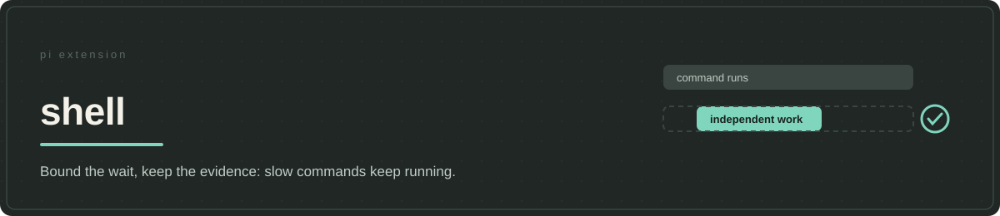

# shell



A command can take longer than the agent expected without being stuck. Killing it at a timeout wastes useful work; waiting indefinitely prevents the agent from making another decision. A large command log presents the same false choice: send everything into the conversation or risk cutting off the line that explains a failure.

Shell separates **process lifetime**, **waiting time**, and **the amount of output shown to the model**. `bash` waits ten seconds by default. If the process is still running, it returns a job ID while the command continues; the agent can work on something independent or use `jobs` to wait for completion and inspect progress. This does not make dependent work safe to start early: the agent still has to wait for a result before relying on it.

## Read what matters without throwing away the run

Shell applies [LeanCTX](https://github.com/yvgude/lean-ctx) to command output. LeanCTX can reduce routine noise while protecting exact output or passing it through when compression would be unsafe. The model receives a bounded preview; the captured output remains in a named local log, so a later `jobs` check can retrieve new lines, matching lines, or the tail of that run without rerunning the command. A rerun may be expensive or produce different evidence.

The boundary matters: the log contains what LeanCTX produced, **not what compression removed**. Select raw, uncompressed capture before running a command whose exact output matters. Standard and error output are combined. Smaller previews do not promise less total context use if the agent subsequently reads the entire log.

A multiline command also becomes a reusable `sh-N` scratch cell. `show` displays its source without running it, `run` repeats it unchanged, `clone` copies it under a new name, and `list` shows the available cells. Twenty are retained; adding another drops the oldest. This helps with local iterations, not durable scripts, which belong in project files.

## Session and security limits

Jobs and scratch cells are session-local. Logs and temporary scripts use the shared `/tmp/jeito-shell` directory; shutdown ends running jobs and removes temporary material there, including scripts another session may share. Do not run Shell tests alongside a live session using that directory. Saved output can contain secrets: Shell does not redact it or isolate commands from the host. Incremental reads advance over captured text even if a preview omits some of it; retrieve omitted text from the saved log.

Shell registers `bash` and `jobs` as tools and a shutdown hook. It adds no commands or skills. Pi already saves oversized tool output; Shell's distinct choices are a soft wait that keeps the process alive, command-aware output handling, and selective inspection across that process's lifetime. Neither total cost nor task speed has been benchmarked here.

## Install from a checkout

Requires Node.js 22.19.0 or newer, npm, Pi satisfying the package's `@earendil-works/pi-coding-agent >=0.82.1` peer dependency, Bash and `tar`. The LeanCTX runtime selector provides macOS and Linux ARM64/x64 artifacts, including Linux GNU and musl; it does not support Windows. These are package targets, not a tested platform matrix. Initial preparation needs network access to the LeanCTX GitHub release. No API key is needed.

Prepare dependencies first:

```bash
cd /absolute/path/to/jeito
npm install --omit=dev \
  --workspace @alehdezp/jeito-shell \
  --include-workspace-root=false
```

Only if npm succeeds, register the prepared checkout:

```bash
pi install "$PWD/extensions/shell"
```

Keep the checkout at the registered path and restart Pi. Do not register it beside the jeito aggregate or another extension that supplies the same tools. Pi local-path registration does not prepare dependencies; Pi Git sources cannot select one monorepo subdirectory. Standalone installation does not apply host-owned prompt or tool-routing defaults. See [installation and updates](../../docs/getting-started.md).

npm `postinstall` downloads LeanCTX 3.9.12 and checks a pinned SHA-256 checksum before extraction, then checks the version. Startup verifies the runtime identity, executable status and binary hash rather than downloading or repairing it. LeanCTX configuration and state stay under this extension's ignored `.runtime/`; setup does not change the global `PATH` or shell startup files. If the runtime is missing or altered, stop Pi, run `npm run setup:lean-ctx` from this extension directory, and restart after successful preparation.

## Verification and attribution

The tests use substituted Bash output and local archives, not live compression quality or a network installation. **Run them only when no live Shell session shares `/tmp/jeito-shell`**, because test shutdown removes scripts from that directory:

```bash
npm test --workspace @alehdezp/jeito-shell
```

LeanCTX owns compression; the shell integration adapts `pi-lean-ctx`. [Third-party notices](THIRD_PARTY_NOTICES.md) record the integration boundary and Apache 2.0 attribution for LeanCTX (Copyright 2026 Yves Gugger). Tests establish command execution and output recording, not a speed advantage, provider behavior, or an improvement in agent outcomes.
