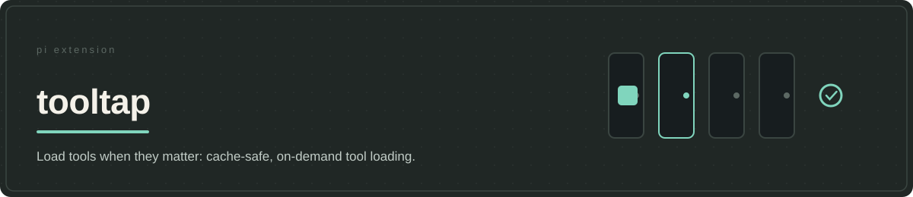

# tooltap



Loading every available tool at startup spends context before the agent knows which ones it needs. Changing the beginning of the prompt to add a tool later can also invalidate the prefix a provider might have cached. One sampled `jobs` definition is 2,187 characters, about 550 tokens at four characters per token; fifty definitions of that size would be roughly 27,000 tokens. This illustrates the cost, not a benchmark of this harness or a measured effect on agent quality.

**tooltap keeps the start small without making later tools unusable.** Its stable `tools` control separates discovery, permission, delivery of a tool's full contract, and execution. When the task calls for another tool, its guidance arrives in a later reply instead of rewriting earlier instructions. Existing input remains eligible for cache reuse; the provider decides whether it actually reuses it. For a small, stable tool set, loading everything upfront is simpler.

## Keep late activation from changing earlier input

Hiding tools at startup is only useful if bringing one back works properly. The agent needs its full contract and permission to execute it. Adding that information must also avoid changing the beginning of an ongoing session's input, where a provider may already have cached substantial work.

Pi's native deferred-tool support addresses schema delivery. In Pi 0.84.3, the version inspected here, ordinary tool activation can still rebuild the system prompt with the tool's extra instructions. A deferred schema therefore does not, by itself, preserve the earlier input. Once that input differs, content after the difference no longer shares the same reusable prefix.


Tooltap separates discovery, executable access and instruction placement. Finding a tool does not authorize its use. Enabling it grants session access and returns the full description, argument schema and usage guidance in the activation reply. Compatible Pi runtime APIs expose the implementation without adding that guidance to earlier instructions.

You can therefore extend the tools available to an ongoing task without rebuilding its starting prompt just to expose them. This is the contribution beyond Pi's deferred transport: selection policy and executable access that preserve instruction placement together, including across registry refreshes and restored sessions.

## Use native deferral where available, a gateway elsewhere

| Execution path | What happens after enablement | Trade-off |
| --- | --- | --- |
| Native deferred tools on supported GPT models | Pi supplies a deferred definition; the model calls the tool by name. | Requires both model support and compatible Pi runtime APIs. |
| Gateway execution | The model supplies the target name and arguments to the existing `tools` control. Tooltap checks permission and invokes the implementation. | Adds an indirect call, but does not require a native deferred-tool API or a new ordinary declaration. |

These are different execution mechanisms serving the same placement constraint. The gateway is not native API calling. A separate direct path supports runtimes that can dispatch enabled but undeclared names; the [execution guide](docs/how-pi-tools-reach-models.md) covers that narrower case.

Missing runtime support must not silently defeat the design. Tooltap uses the gateway when it can preserve the contract; otherwise execution fails explicitly. It does not insert the target into the ordinary tool list merely to make a call succeed. Within the same provider, API and model, the starting declarations stay stable. A genuine model switch establishes a new starting list containing already-enabled tools; reselecting the same model does not.

## Choose what the agent may discover

The host decides which tools start active, which may be enabled later, and which names or groups provide explicit access. The agent can request an exact name, a logical group such as `web-stack`, or a capability in plain language; `/tool` and exact `##` markers provide explicit controls. A fuzzy match grants access only when it clears the host-curated description and ranking checks; otherwise it returns suggestions, never permission from installed tool prose. The [selection contract](docs/contract.md#selector-resolution) defines the thresholds and marker syntax. Host `toolOverrides` can revise a tool's discovery description and guidance before delivery, so selection and the activated contract use the same wording.

Groups let a task activate a related set with one request rather than naming tools one by one. That saves discovery steps, not tool context: enabled definitions accumulate while they remain on. The policy also needs configuration and runtime maintenance, another exchange for discovery, and serialized calls on some routes. tooltap defers these costs until relevant; it does not eliminate them.

Focused tests check successful execution and stable earlier input together. The generated-prompt regression includes Pi 0.84.3 ordinary activation as a negative control. These establish the integration's behavior, not a promised cache hit. [OpenAI's caching documentation](https://developers.openai.com/api/docs/guides/prompt-caching) explains the matching-prefix requirement; cache lifetime and reuse still belong to the provider. [Anthropic's Tool Search results](https://www.anthropic.com/engineering/advanced-tool-use) motivate selective loading but are not measurements of Tooltap. Lower total cost and fewer tool-selection errors remain unmeasured here.

## Public controls

`tools` is the single stable model-facing control. `/tool` and exact markers request names or groups; `/stow-dump-context` saves tooltap's latest observed provider input for local diagnosis. These controls do not make a source description trustworthy or prove the final payload after other handlers run.

## Runtime requirements and installation

You need Node.js 22.19 or newer. The package declares Pi `>=0.84.2`, but the version number alone does not mean your Pi runtime can execute the requested tools. The execution paths have these requirements:

- Native requires Pi model support for deferred tools, plus `setActiveToolsWithDeferred` and `getRegisteredTool` runtime APIs.
- Direct requires `getDispatchTools` and `setDispatchTools`.
- Gateway execution requires `getRegisteredTool`.

If native or direct support is missing, Tooltap uses gateway execution. If `getRegisteredTool` is missing too, you can still request tools, but their execution fails with an error. Tooltap will not work around this by changing the starting tool list. A model setting such as `gpt-^` cannot supply missing runtime APIs.

Read the [runtime compatibility guide](docs/how-pi-tools-reach-models.md#treat-runtime-capabilities-as-execution-boundaries) before installing. Neither installation nor normal startup applies the runtime patch. If you need to adapt Pi's runtime, stop Pi first, then restart and verify the change.

Install this private, pre-release package from a local checkout. Pi Git sources cannot install just one package from this repository. Do not register tooltap separately if your full jeito installation already includes it.

```bash
cd /absolute/path/to/jeito
npm install --omit=dev \
  --workspace @alehdezp/tooltap \
  --include-workspace-root=false
```

Only after npm preparation succeeds:

```bash
pi install "$PWD/extensions/tooltap"
```

Restart Pi after registration. See [installation and updates](../../docs/getting-started.md) for updating or removing the checkout.

## Configuration and diagnostics

Tooltap reads your `~/.pi/agent/tool.yaml` to choose starting tools, search rules, groups and execution paths for each model. The internal `proxy` setting selects gateway execution through `tools`. The [configuration template](tool.yaml.template) explains the settings; the full suite's [defaults](../../config/tool.yaml) show one configuration. Standalone installation applies neither. Use `/skill:jeito-setup` to preview configuration changes, back up the current file and confirm what to apply.

Optional local diagnostic logging is off by default. `/stow-dump-context <label>` saves the latest observed input sent to the provider, including the prompt, for inspection on your machine. Treat these files as sensitive: they may contain conversation and tool data.

## Verification

From a development checkout with development dependencies installed:

```bash
npm run verify --workspace @alehdezp/tooltap
```

This checks types, tests the extension and its runtime adaptation, and checks which files the package would include. The root [request-format tests](../../tests/tooltap-prompt-prefix.test.mjs) and [generated-instruction tests](../../tests/tooltap-native-runtime.test.mjs) check that enabling tools leaves earlier input unchanged. Local tests cannot prove that a provider will accept a request or reuse its cached input. See [live verification](docs/real-world-verification.md) for checking execution and the requests sent by your selected runtime.
